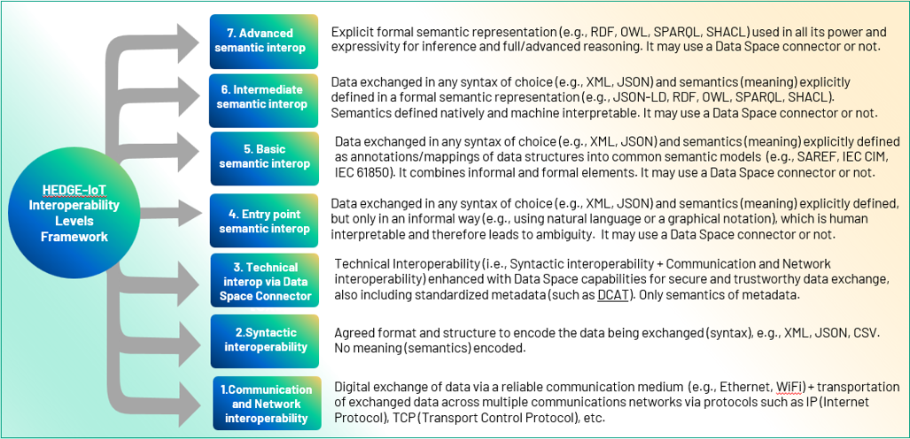
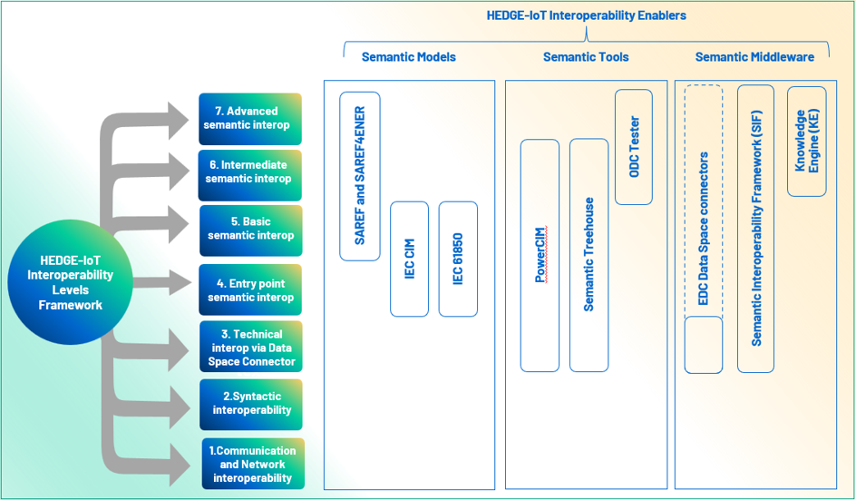

# interfaces-and-tools-for-interoperability

This Git repository contains information about the various HEDGE-IoT interfaces and tools for interoperability, including educational material for stakeholders. It has been developed in Task 3.1 as part of Deliverable 3.2 and is maintained in the context of Task 4.3. 

This online resource will be updated with new interfaces, tools, and educational materials as they become available through ongoing activities in the project.

## Interoperability Levels Framework
Within the HEDGE-IoT project, starting from estabilshed frameworks that define interoperability levels, such as the [European Interoperability Framework (EIF) Toolbox](https://interoperable-europe.ec.europa.eu/collection/nifo-national-interoperability-framework-observatory/solution/european-interoperability-framework-eif-toolbox/levels-interoperability), we follow the distinction in technical, semantic, and organizational interoperability. However, semantically interoperability is typically represented as one single level, while we encountered the need to further refine it. As a result, we propose the following framework, which introduces seven distinct levels of interoperability, covering everything from basic data exchange (network and syntactic interoperability) to advanced semantic understanding where systems can “reason” about the data they receive:

## Interoperability Enablers 

This section introduces the “interoperability enablers”, namely semantic models, platforms or tools that could support the HDEGE-IoT partners and external stakeholders to create and deploy their semantic interoperable solutions. The interoperability enablers are building blocks that can be used to build and deploy interoperable solutions. These building blocks can be used individually or combined together. This online repository is a live artefact that is updated during the project, therefore, more interoperability enablers can be added in later stages. 

**Semantic Models**
- [SAREF and SAREF4ENER](https://saref.etsi.org/) 
- [IEC 61850](https://iec61850.dvl.iec.ch/)
- [IEC Common Information Model (CIM)](https://www.entsoe.eu/digital/common-information-model/)
    - [IEC 61970-301:2020](https://webstore.iec.ch/en/publication/62698)
    - [IEC 61970-452:2021](https://webstore.iec.ch/en/publication/64844)
    - [IEC 61970-456:2021](https://webstore.iec.ch/en/publication/68054)
    - [IEC 61970-552:2016](https://webstore.iec.ch/en/publication/25939)
    - [IEC 61970-600-1:2021](https://webstore.iec.ch/en/publication/63866)
    - [IEC 61970-600-2:2021](https://webstore.iec.ch/en/publication/63867)
    - [IEC 61968-11:2013](https://webstore.iec.ch/en/publication/6199)
    - [IEC 61968-13:2021](https://webstore.iec.ch/en/publication/34213)
- [IEC 62325-301 CIM Framework for energy market communications](https://webstore.iec.ch/en/publication/31487)

**Semantic tools**
- [PowerCIM](https://www.koncar.hr/en/digital-solutions-and-platforms) 
- [Semantic Treehouse](https://www.semantic-treehouse.nl/) 
- [Ontology-Driven Constraint Tester (ODCT)](https://www.springerprofessional.de/en/design-of-an-ontology-driven-constraint-tester-odct-and-applicat/50633306) 

**Semantic Middleware**
- [Knowledge Engine](https://www.knowledge-engine.eu/)
- [Semantic Interoperability Famework (SIF)](https://gitlab.inesctec.pt/groups/interconnect-public/-/wikis/home#semantic-interoperability-layer---knowledge-engine)
- [Dataspace Connectors - Eclipse Dataspace Components (EDC)](https://github.com/eclipse-edc/))

The figure below shows the positioning of the interoperability enablers with respect to the HEDGE-IoT interoperability levels framework: 

NOTE: the EDC dataspace connector interoperability enabler is used at level 3 (technical interoperability via data space connector), as it natively includes only semantic metadata. However, if complemented with native semantic solutions (like SAREF, SIF or KE, for example), the dataspace connector interoperability enabler can be used up to the highest level 7 to reach advanced semantic interoperability. This is reflected in the Figure above, where the EDC dataspace connector is visualized with a solid line at level 3, and a dashed line from level 4 to level 7.  

## Educational Material on Interoperability 

Recognizing the complexity of semantic interoperability, the HEDGE-IoT project has prioritized the production and dissemination of clear, practical educational resources. This helps energy professionals, IT developers, and other stakeholders understand and apply these concepts confidently, fostering innovation and practical adoption across Europe.

- [Linked Data and Ontologies tutorial](./Educational%20Material/Linked%20Data%20and%20Ontologies%20tutorial) 
- [SAREF tutorial](./Educational%20Material/SAREF%20tutorial) 
- [SAREF4ENER tutorial](./Educational%20Material/SAREF4ENER%20tutorial) 
- [IEC CIM tutorial](./Educational%20Material/IEC%20CIM%20tutorial)
- [IEC 62325-301 tutorial](https://msites.epri.com/rd/research/062333/common-information-model-primer/chapter-1-introduction-to-the-iec-cim)
- [IEC 61850 tutorial](https://www.omicronenergy.com/en/training/courses/detail/introduction-to-iec-61850-1/2155/)
- [PowerCIM tutorial](./Educational%20Material/PowerCIM%20tutorial) 
- Ontology-Driven Constraint Tester tutorial
- [Semantic Treehouse tutorial](./Educational%20Material/Semantic%20Treehouse%20tutorial) 
- [Knowledge Engine tutorial](./Educational%20Material/Knowledge%20Engine%20tutorial)
- [Semantic Interoperability Famework (SIF) tutorials](https://gitlab.inesctec.pt/groups/interconnect-public/-/wikis/home#tutorials)
 
## Extended interfaces for Interoperability 

We define a platform as a digital infrastructure that runs software and facilitates data exchange with external parties. Services within the platform offer functionalities, and interfaces enable access to these services. In HEDGE-IoT, we enhance platform interoperability by extending interfaces, allowing seamless information exchange. A structured library of these extended interfaces is provided below, including metadata such as contributors, usage context, interoperability level, and availability.

<!-- Dutch pilot -->
<table>
    <tbody>
              <tr><th><strong>Name:&nbsp;</strong>SolarEdge KB</th><th><strong>Main contributor:&nbsp;</strong>TNO</th><th><strong>Main contact:&nbsp;</strong>barry.nouwt@tno.nl</th></tr> 
        <tr><td><strong>Original platform:&nbsp;</strong>[SolarEdge interface](https://knowledge-center.solaredge.com/sites/kc/files/se_monitoring_api.pdf)</td><td><strong>Other contributors:&nbsp;</strong>AB, VU</td><td><strong>Interoperability enablers:&nbsp;</strong>Knowledge Engine, SAREF, Semantic TreeHouse</td></tr>
        <tr><td><strong>Open source:&nbsp;</strong>yes</td><td><strong>Pilot:&nbsp;</strong>Dutch</td><td><strong>Interoperability level:&nbsp;</strong>6 – Intermediate semantic interop</td></tr>
        <tr><td><strong>Source code:&nbsp;</strong>https://git.dstech.info/hedge-iot/solaredge-kb</td><td><strong>Beneficiary user:&nbsp;</strong>PV owners</td><td><strong>Educational material:&nbsp;</strong>Knowledge Engine</td></tr>
        <tr><td><strong>Status:&nbsp;</strong>Available</td><td><strong>Poisition in IoT/Electricity value chain:&nbsp;</strong>Home/Building premises</td><td><strong>Additional notes:&nbsp;</strong></td></tr>
        <tr><td colspan="3">This is one of the proprietary APIs that have been extended in the HEDGE-IoT project with semantic adapters in order to be used with the Knowledege Engine middleware. This has been done creating a Knowledge Base can be used to connect semantically to the API of SolarEdge.</td></tr>
    </tbody>
</table>

<table>
    <tbody>
        <tr><th><strong>Name:&nbsp;</strong>Meetdata KB</th><th><strong>Main contributor:&nbsp;</strong>TNO</th><th><strong>Main contact:&nbsp;</strong>barry.nouwt@tno.nl</th></tr> 
        <tr><td><strong>Original platform:&nbsp;</strong>[Kenter interface](https://www.kenter.nu/wp-content/uploads/2024/10/Manual-Metering-data-API-ENG-v1-2.pdf)</td><td><strong>Other contributors:&nbsp;</strong>AB, VU</td><td><strong>Interoperability enablers:&nbsp;</strong>Knowledge Engine, SAREF, Semantic TreeHouse</td></tr>
        <tr><td><strong>Open source:&nbsp;</strong>yes</td><td><strong>Pilot:&nbsp;</strong>Dutch</td><td><strong>Interoperability level:&nbsp;</strong>6 – Intermediate semantic interop</td></tr>
        <tr><td><strong>Source code:&nbsp;</strong>https://git.dstech.info/hedge-iot/meetdata-kb</td><td><strong>Beneficiary user:&nbsp;</strong>Meetdata customers</td><td><strong>Educational material:&nbsp;</strong>Knowledge Engine</td></tr>
        <tr><td><strong>Status:&nbsp;</strong>Available</td><td><strong>Poisition in IoT/Electricity value chain:&nbsp;</strong></td><td><strong>Additional notes:&nbsp;</strong></td></tr>
        <tr><td colspan="3">This is one of the proprietary APIs that have been extended in the HEDGE-IoT project with semantic adapters in order to be used with the Knowledege Engine middleware. This has been done creating a Knowledge Base can be used to connect semantically to the API of Meetdata.nl.</td></tr>
    </tbody>
</table>

<table>
    <tbody>
        <tr><th><strong>Name:&nbsp;</strong>HetMeetbedrijf KB</th><th><strong>Main contributor:&nbsp;</strong>TNO</th><th><strong>Main contact:&nbsp;</strong>barry.nouwt@tno.nl</th></tr> 
        <tr><td><strong>Original platform:&nbsp;</strong>[Het Meetbedrijf interface](https://partner.hetmeetbedrijf.nl/api/)</td><td><strong>Other contributors:&nbsp;</strong>AB, VU</td><td><strong>Interoperability enablers:&nbsp;</strong>Knowledge Engine, SAREF, Semantic TreeHouse</td></tr>
        <tr><td><strong>Open source:&nbsp;</strong>yes</td><td><strong>Pilot:&nbsp;</strong>Dutch</td><td><strong>Interoperability level:&nbsp;</strong>6 – Intermediate semantic interop</td></tr>
        <tr><td><strong>Source code:&nbsp;</strong>https://git.dstech.info/hedge-iot/hetmeetbedrijf-kb</td><td><strong>Beneficiary user:&nbsp;</strong>Het Meetbedrijf customers</td><td><strong>Educational material:&nbsp;</strong>Knowledge Engine</td></tr>
        <tr><td><strong>Status:&nbsp;</strong>Available</td><td><strong>Poisition in IoT/Electricity value chain:&nbsp;</strong></td><td><strong>Additional notes:&nbsp;</strong></td></tr>
        <tr><td colspan="3">This is one of the proprietary APIs that have been extended in the HEDGE-IoT project with semantic adapters in order to be used with the Knowledege Engine middleware. This has been done creating a Knowledge Base can be used to connect semantically to the API of HetMeetbedrijf.</td></tr>
    </tbody>
</table>

<table>
    <tbody>
        <tr><th><strong>Name:&nbsp;</strong>BlueCurrent KB</th><th><strong>Main contributor:&nbsp;</strong>TNO</th><th><strong>Main contact:&nbsp;</strong>barry.nouwt@tno.nl</th></tr> 
        <tr><td><strong>Original platform:&nbsp;</strong>[Bluecurrent interface](https://pypi.org/project/bluecurrent-api/)</td><td><strong>Other contributors:&nbsp;</strong>AB, VU</td><td><strong>Interoperability enablers:&nbsp;</strong>Knowledge Engine, SAREF, Semantic TreeHouse</td></tr>
        <tr><td><strong>Open source:&nbsp;</strong>yes</td><td><strong>Pilot:&nbsp;</strong>Dutch</td><td><strong>Interoperability level:&nbsp;</strong>6 – Intermediate semantic interop</td></tr>
        <tr><td><strong>Source code:&nbsp;</strong>https://git.dstech.info/hedge-iot/bluecurrent-kb</td><td><strong>Beneficiary user:&nbsp;</strong>EV owners</td><td><strong>Educational material:&nbsp;</strong>Knowledge Engine</td></tr>
        <tr><td><strong>Status:&nbsp;</strong>Available</td><td><strong>Poisition in IoT/Electricity value chain:&nbsp;</strong></td><td><strong>Additional notes:&nbsp;</strong></td></tr>
        <tr><td colspan="3">This is one of the proprietary APIs that have been extended in the HEDGE-IoT project with semantic adapters in order to be used with the Knowledege Engine middleware. This has been done creating a Knowledge Base can be used to connect semantically to the API of BlueCurrent.</td></tr>
    </tbody>
</table>

<!-- Finnish pilot -->
<table>
    <tbody>
        <tr><th><strong>Name:&nbsp;</strong>Edge Platform</th><th><strong>Main contributor:&nbsp;</strong>[ABB](https://global.abb/group/en)</th><th><strong>Main contact:&nbsp;</strong>anna.kulmala@fi.abb.com</th></tr> 
        <tr><td><strong>Original platform:&nbsp;</strong>[Smart substation control and protection SSC600 SW](https://new.abb.com/medium-voltage/digital-substations/protection-relays/multiapplication/smart-substation-control-and-protection-ssc600-sw)</td><td><strong>Other contributors:&nbsp;</strong>[TAU](https://www.tuni.fi/en), [VTT](https://www.vttresearch.com/en) </td><td><strong>Interoperability enablers:&nbsp;</strong>IEC 61850</td></tr>
        <tr><td><strong>Open source:&nbsp;</strong>No</td><td><strong>Pilot:&nbsp;</strong>Finnish</td><td><strong>Interoperability level:&nbsp;</strong>5 - Basic semantic interoperability</td></tr>
        <tr><td><strong>Source code:&nbsp;</strong>N/A (commercial)</td><td><strong>Beneficiary user:&nbsp;</strong>[JSE](https://www.jseoy.fi/en/), [Enerva](https://enerva.fi/en/welcome/)  </td><td><strong>Educational material:&nbsp;</strong>[IEC 61850 tutorial](https://www.omicronenergy.com/en/training/courses/detail/introduction-to-iec-61850-1/2155/)</td></tr>
        <tr><td><strong>Status:&nbsp;</strong>under development</td><td><strong>Poisition in IoT/Electricity value chain:&nbsp;</strong>DSO</td><td><strong>Additional notes:&nbsp;</strong>...</td></tr>
        <tr><td colspan="3"><strong>Functional description:&nbsp;</strong> The Edge Platform is a solution developed by ABB as part of the Finnish pilot in the Hedge-IoT project on top of the existing ABB centralized protection solution SSC600 SW (therefore the ABB Egde Platform extends the original platform SSC600 SW). The ABB edge platform enables sharing high volume data with strict real-time requirements between different applications that are executed on an edge server in a virtualization environment. Other contributors are, on one hand, TAU and VTT whose algorithms utilize data provided by the ABB edge platform, and on the other hand, JSE and Enerva who own the IEDs (JSE) and the SCADA (Enerva) with which communication is respectively through IEC 61850 and IEC 60870-5-104.
     </td></tr>
    </tbody>
</table>

<table>
    <tbody>
        <tr><th><strong>Name:&nbsp;</strong>EDC Data Space Connector for edge and cloud </th><th><strong>Main contributor:&nbsp;</strong>[TAU](https://www.tuni.fi/en)</th><th><strong>Main contact:&nbsp;</strong>sami.repo@tuni.fi</th></tr> 
        <tr><td><strong>Original platform:&nbsp;</strong> N/A (novel connection that has never been realized before)</td><td><strong>Other contributors:&nbsp;</strong>N/A) </td><td><strong>Interoperability enablers:&nbsp;</strong>Dataspace Connectors - Eclipse Dataspace Components (EDC)</td></tr>
        <tr><td><strong>Open source:&nbsp;</strong>Yes</td><td><strong>Pilot:&nbsp;</strong>Finnish</td><td><strong>Interoperability level:&nbsp;</strong>3 - Technical interoperability via Data Space Connector</td></tr>
        <tr><td><strong>Source code:&nbsp;</strong> Not yet available </td><td><strong>Beneficiary user:&nbsp;</strong> DSO, system integrator </td><td><strong>Educational material:&nbsp;</strong>EDC tutorials </td></tr>
        <tr><td><strong>Status:&nbsp;</strong> under development - relase planned in 2026 </td><td><strong>Poisition in IoT/Electricity value chain:&nbsp;</strong>DSO</td><td><strong>Additional notes:&nbsp;</strong>...</td></tr>
        <tr><td colspan="3"><strong>Functional description:&nbsp;</strong> This EDC connection is utilized to connect predictive congestion management (CM) in the cloud to real-time CM in the edge. In the current state-of-the-art, real-time and predictive CM work independently, or if interaction exists, it is realized manually by DSO operator. The Hedge-IoT project advances the current state-of-the-art by creating an EDC for the interaction of edge and cloud that enables update and modification of edge algorithms from the app store located on the cloud. Therefore, EDC prevents the edge from being siloed and gives it a level of agility so that, ideally, it keeps being updated when necessary/possible. The EDC also adds capabilities concerning data governance (who can access data, under what conditions, etc.).
     </td></tr>
    </tbody>
</table>

<!-- Slovenian pilot -->
<table>
    <tbody>
        <tr><th><strong>Name:&nbsp;</strong>Substation semantic model extended with metering and Dynamic Thermal Rating (DTR) data</th><th><strong>Main contributor:&nbsp;</strong>[KONČAR](https://www.koncar.hr/en)</th><th><strong>Main contact:&nbsp;</strong>Josipa Stegic &lt;josipa.stegic@koncar.hr&gt;</th></tr> 
        <tr><td><strong>Original platform:&nbsp;</strong>[PowerCIM](https://www.koncar.hr/en)</td><td><strong>Other contributors:&nbsp;</strong>[Elektro-Gorenjska](https://talentjourney.scv.si/partners/elektro-gorenjska/)</td><td><strong>Interoperability enablers:&nbsp;</strong>IEC CIM, [Power CIM](https://www.koncar.hr/en/digital-solutions-and-platforms)</td></tr>
        <tr><td><strong>Open source:&nbsp;</strong>No</td><td><strong>Pilot:&nbsp;</strong>Slovenian</td><td><strong>Interoperability level:&nbsp;</strong>6. Intermediate semantic interoperability</td></tr>
        <tr><td><strong>Source code:&nbsp;</strong>N/A (commercial)</td><td><strong>Beneficiary user:&nbsp;</strong>DSO</td><td><strong>Educational material:&nbsp;</strong>PowerCIM tutorial, IEC CIM tutorial</td></tr>
        <tr><td><strong>Status:&nbsp;</strong>Available</td><td><strong>Poisition in IoT/Electricity value chain:&nbsp;</strong>DSO, TSO</td><td><strong>Additional notes:&nbsp;</strong></td></tr>
        <tr><td colspan="3">This interface extends the Power CIM platform with novel functionality to integrate smart metering data and Dynamic Thermal Rating (DTR) calculation at the edge. The DTR calculation is performed on IoT devices located at secondary transformers substations in the DSO grid. This functionality is crucial for immediate response to fluctuating network conditions without relying on remote servers or cloud systems. DTR allows the calculation of the optimal transformer load based on its temperature, enabling transformers to be overloaded beyond their rated power in favorable weather conditions without affecting their lifespan. The extended Power CIM platform facilitates the integration of models from different systems within the distribution network, including GIS, DTR calculation, metering and environmental models. Typically, the subsystems utilized by the DSO are isolated and do not communicate with one another. This solution addresses the challenges of achieving interoperability and data standardization, identifying redundancy, and harmonizing across different data sources by using the Common Information Model (CIM) framework as defined by IEC 61968 and 61970 standards.</td></tr>
    </tbody>
</table>

<!--Italian pilot -->
<table>
    <tbody>
        <tr><th><strong>Name:&nbsp;</strong>Apio Balance semantic mapping for energy market and edge devices</th><th><strong>Main contributor:&nbsp;</strong><a href="https://www.apio.cc/">APIO</a></th><th><strong>Main contact:&nbsp;</strong>Mattia Alfieri &lt;m.alfieri@apio.cc&gt;</th></tr> 
        <tr><td><strong>Original platform:&nbsp;</strong>[Apio Balance](https://balance.apio.network/)</td><td><strong>Other contributors:&nbsp;</strong>ARETI, Acea Energia</td><td><strong>Interoperability enablers:&nbsp;</strong>SAREF and SAREF4ENER, Semantic Tree House</td></tr>
        <tr><td><strong>Open source:&nbsp;</strong>No</td><td><strong>Pilot:&nbsp;</strong>Italian</td><td><strong>Interoperability level:&nbsp;</strong>5. Basic semantic interoperability</td></tr>
        <tr><td><strong>Source code:&nbsp;</strong>N/A (commercial)</td><td><strong>Beneficiary user:&nbsp;</strong>Aggregator, DSO</td><td><strong>Educational material:&nbsp;</strong>SAREF tutorial, SAREF4ENER tutorial, Semantic Tree House tutorial</td></tr>
        <tr><td><strong>Status:&nbsp;</strong>Apio Balance platofrm available, semantic mappings under development, expected release in Q1 2026</td><td><strong>Poisition in IoT/Electricity value chain:&nbsp;</strong>Behind meter, After meter, Local grid, Aggregator, Distribution System Operator (DSO)</td><td><strong>Additional notes:&nbsp;</strong>the SAREFized version of the data exchange will be open source </td></tr>
        <tr><td colspan="3">Apio Balance is a full featured Distributed Energy Resources (DERs) management platform with first class support for Renewable Energy Communities (RECs). It supports the integration of heterogeneous DERs, from households to production sites, from EVs to BESS, allowing aggregators to manage them, configure them as Virtual Power Plants (VPPs) and exploit their flexibility maximizing both energetic and economic performances. In the HEDGE-IoTproject, Apio Balance is extended with semantic capabilities to map its (syntactical) JSON message exchange with the energy market on one side (e.g., market offers and requests)  , and the edge devices on the other side (e.g., measurements and activations) into a semantically annotated message exchange using established standards like SAREF and SAREF4ENER. The mapping into SAREF-based common semantics is done using the Semantic Tree House as an interoperability enabler.      
</td></tr>
    </tbody>
</table>

<table>
    <tbody>
        <tr><th><strong>Name:&nbsp;</strong>PGUI semantic mappings to SAREF </th><th><strong>Main contributor:&nbsp;</strong><a href="https://www.areti.it/">ARETI</a></th><th><strong>Main contact:&nbsp;</strong>Gabriele Fedele gabriele.fedele@areti.it &lt;&gt;</th></tr> 
        <tr><td><strong>Original platform:&nbsp;</strong>ARETI PGUI</td><td><strong>Other contributors:&nbsp;</strong>[APIO](https://www.apio.cc/), Acea Energia</td><td><strong>Interoperability enablers:&nbsp;</strong>SAREF and SAREF4ENER, Semantic Tree House</td></tr>
        <tr><td><strong>Open source:&nbsp;</strong>No</td><td><strong>Pilot:&nbsp;</strong>Italian</td><td><strong>Interoperability level:&nbsp;</strong>5. Basic semantic interoperability</td></tr>
        <tr><td><strong>Source code:&nbsp;</strong>N/A (commercial)</td><td><strong>Beneficiary user:&nbsp;</strong>End user, DSO</td><td><strong>Educational material:&nbsp;</strong>SAREF tutorial, SAREF4ENER tutorial, Semantic Tree House tutorial</td></tr>
        <tr><td><strong>Status:&nbsp;</strong> semantic mappings under development, expected release in Q1 2026</td><td><strong>Poisition in IoT/Electricity value chain:&nbsp;</strong>Behind meter, After meter, Local grid</td><td><strong>Additional notes:&nbsp;</strong>the SAREFized version of the data exchange will be open source </td></tr>
        <tr><td colspan="3">The  PGUI (Power Grid User Interface) is a device capable of providing data exchange and edge functionalities required to enable ancillary services between grid operators (TSOs, DSOs and BSPs) and the distributed energy resource owner. The main objective of the PGUI is to make the signed, correct measurements available to the network operators with adequate timing for the monitoring and management of the Distributed Resources. The PGUI is also able to receive activation signals from the DSO and to make them available in the field to other systems located in the customer’s premises, such as EMSs and BESSs. In the HEDGE-IoTproject, the PGUI is extended with semantic capabilities to map its (syntactical) JSON message exchange about smart meter time series measurement data into a semantically annotated message exchange using established standards like SAREF and SAREF4ENER. The mapping into SAREF-based common semantics is done using Semantic Tree House as an interoperability enabler.      
.</td></tr>
    </tbody>
</table>

<!-- Portuguese pilot -->
<table>
    <tbody>
        <tr><th><strong>Name:&nbsp;</strong>Integrated Energy Management System for commercial buildings</th><th><strong>Main contributor:&nbsp;</strong>INESC TEC</th><th><strong>Main contact:&nbsp;</strong>Name Surname &lt;email address&gt;</th></tr> 
        <tr><td><strong>Original platform:&nbsp;</strong>[Schneider Electric Platform](https://www.se.com/ww/en/product-range/62111-ecostruxure-building-operation/#overview)</td><td><strong>Other contributors:&nbsp;</strong>SONAE, Schneider Electric</td><td><strong>Interoperability enablers:&nbsp;</strong>SIF, Knowledge Engine, SAREF</td></tr>
        <tr><td><strong>Open source:&nbsp;</strong>platform: no (commercial), but graph patterns (semantics) yes</td><td><strong>Pilot:&nbsp;</strong>Portuguese</td><td><strong>Interoperability level:&nbsp;</strong>6 - Intermediate semantic interoperability</td></tr>
        <tr><td><strong>Source code:&nbsp;</strong>...</td><td><strong>Beneficiary user:&nbsp;</strong>SONAE retail stores, DSO</td><td><strong>Educational material:&nbsp;</strong>SIF tutorial, Knowledge Engine tutorial, SAREF tutorial</td></tr>
        <tr><td><strong>Status:&nbsp;</strong>available </td><td><strong>Poisition in IoT/Electricity value chain:&nbsp;</strong>Behind meter, Aggregator, Distribution System Operator (DSO)</td><td><strong>Additional notes:&nbsp;</strong>Innovation originally created in the H2020 Interconnect project and reused in HEDGE-IoT</td></tr>
        <tr><td colspan="3">The Schneider Electric platform connects meters from various tertiary buildings/retail store buildings (SONAE) and has been extended with semantic capabilities provided by the SIF to collect meter information from different sources, harmonize it and allow reasoning.  It serves the purpose of integrating advanced energy management systems within commercial buildings. It is deployed in several retail store buildings across Portugal, aiming to optimize energy management for cost savings and improved grid operation. Key component is an integrated Energy Management System (iEMS) that brings together the building management systems of multiple commercial buildings. This system uses the semantic interoperability framework (SIF) and SAREF to enable different systems and devices to communicate seamlessly, demonstrating the aggregation of flexibility from commercial buildings, considering various devices such as heating and cooling systems. This flexibility can then be offered to the Distribution System Operator (DSO) to support grid management.
Moreover, this introduces new methods for acquiring data to operate the distribution grid, utilizing the created interoperability to enhance network observability. This allows for better monitoring and control of energy consumption and production within commercial buildings, ultimately leading to more efficient energy use and cost savings.
</td></tr>
    </tbody>
</table>

<table>
    <tbody>
        <tr><th><strong>Name:&nbsp;</strong>Edge Connect extended interface towards Real-Time Reserve Market Simulator</th><th><strong>Main contributor:&nbsp;</strong>INESC TEC</th><th><strong>Main contact:&nbsp;</strong>Fabio Coelho &lt;fabio.a.coelho@inesctec.pt&gt;</th></tr> 
        <tr><td><strong>Original platform:&nbsp;</strong>N/A (developed from scratch in HEDGE-IoT)</td><td><strong>Other contributors:&nbsp;</strong>R&D Nester</td><td><strong>Interoperability enablers:&nbsp;</strong>IEC  62325-351 - CIM European market model exchange profile</td></tr>
        <tr><td><strong>Open source:&nbsp;</strong>to be disclosed in the next period </td><td><strong>Pilot:&nbsp;</strong>Portuguese</td><td><strong>Interoperability level:&nbsp;</strong>5 - Basic semantic interoperability</td></tr>
        <tr><td><strong>Source code:&nbsp;</strong>N/A (commercial)</td><td><strong>Beneficiary user:&nbsp;</strong>SONAE, CEVE, INESC TEC, RDNester</td><td><strong>Educational material:&nbsp;</strong>SIF tutorial, Knowledge Engine tutorial, SAREF tutorial</td></tr>
        <tr><td><strong>Status:&nbsp;</strong>Under development at pilot testing. Will be released by Q4 2025</td><td><strong>Poisition in IoT/Electricity value chain:&nbsp;</strong> Prosumer, Aggregator, System Operator (SO)</td><td><strong>Additional notes:&nbsp;</strong>Provides services and integration across the complete flexibility value-chain (multi-tenant / multi-role). Innovation originally created in the HEU BeFlexible project. Multi aggregator (bilateral agreement) and extension with BSP markets under development in HEDGE-IoT.</td></tr>
        <tr><td colspan="3">Edge Connect is a digital platform developed in HEDGE-IoT that provides stakeholders (i.e., consumers, service providers, aggregators, DSOs) along the value chain of flexibility provision with an integrated ecosystem to support all main activities in this value chain, to help identify, unlock and make use of all available flexibility potential . Interoperability is a key feature in the extended interface of the Edge Connect platform towards the Real-Time Reserve Market Simulator component. The IEC 62325-351 standard is used in this extended interface to enable basic semantic interoperability based on message exchange agreed upon a syntactical standard. The IEC 62325-351 standard represents the bids for flexibility in the market and define suitable concepts to rreceive bids, provide bid validation, provide selection notification, provide activation signal, receive metering data and Provide Settlement notification.</td></tr>
    </tbody>
</table>

<!-- Greek pilot -->
<table>
    <tbody>
        <tr><th><strong>Name:&nbsp;</strong>HEDGE-IoT Local Flexibiliy Market (LFM) Platform</th><th><strong>Main contributor:&nbsp;</strong>HEnEx</th><th><strong>Main contact:&nbsp;</strong>Sotirios Filippou  &lt;s.filippou@enexgroup.gr&gt;</th></tr> 
        <tr><td><strong>Original platform:&nbsp;</strong>N/A (developed from scratch in HEDGE-IoT)</td><td><strong>Other contributors:&nbsp;</strong></td><td><strong>Interoperability enablers:&nbsp;</strong>none (custom data model)</td></tr>
        <tr><td><strong>Open source:&nbsp;</strong>No</td><td><strong>Pilot:&nbsp;</strong>Greek</td><td><strong>Interoperability level:&nbsp;</strong>4. Entry point semantic interoperability</td></tr>
        <tr><td><strong>Source code:&nbsp;</strong>N/A (commercial)</td><td><strong>Beneficiary user:&nbsp;</strong>DSO</td><td><strong>Educational material:&nbsp;</strong>...</td></tr>
        <tr><td><strong>Status:&nbsp;</strong>First version available (with registration and trading interfaces). The second version is under development.</td><td><strong>Poisition in IoT/Electricity value chain:&nbsp;</strong>Behind meter, Local grid, Aggregator, Distribution System Operator (DSO)</td><td><strong>Additional notes:&nbsp;</strong>DSO/TSO coordination is a potential area for future semantic interoperability interface extension</td></tr>
        <tr><td colspan="3">This is not properly an extended interface, but a novel platform developed in the HEDGE-IoT project that comprises several interfaces such as: Trading Interface, Registration Interface, User Notification and Alert Service, Analytics and Reporting Interface.  The platform is designed to enable and facilitate Local Flexibility Market (LFM) trading. It provides a digital marketplace where energy producers, consumers, and prosumers (those who both produce and consume energy) can trade energy flexibility in real time. By connecting IoT devices and smart meters, the platform gathers data on energy demand, supply, and flexibility needs. This information enables participants to offer flexibility services, such as adjusting energy consumption or production levels, which grid operators can purchase to balance the local grid. Currently, the first release includes registration and trading interfaces. Future releases will include the other interfaces (such as notification) and invest some effort in increasing the interoperability level to “5. Basic semantic interoperability” by mapping the custom data model into a standard open data model that represents concepts for market operations, energy flow, bidding zones and medium voltage systems.</td></tr>
    </tbody>
</table>

<table>
    <tbody>
        <tr><th><strong>Name:&nbsp;</strong>Home Management System</th><th><strong>Main contributor:&nbsp;</strong>ICCS</th><th><strong>Main contact:&nbsp;</strong>Nikos  &lt;email address&gt;</th></tr> 
        <tr><td><strong>Original platform:&nbsp;</strong>N/A (developed from scratch in HEDGE-IoT)</td><td><strong>Other contributors:&nbsp;</strong></td><td><strong>Interoperability enablers:&nbsp;</strong>Dataspace Connectors - Eclipse Dataspace Components (EDC)</td></tr>
        <tr><td><strong>Open source:&nbsp;</strong>No (parts of it being utilised, could be open source, for example the AI applications embedded-could be also be part of the App Store, to be confirmed once WP4 activities have been advanced)</td><td><strong>Pilot:&nbsp;</strong>Greek</td><td><strong>Interoperability level:&nbsp;</strong>3. Technical interoperability via Data Space Connector</td></tr>
        <tr><td><strong>Source code:&nbsp;</strong>N/A (commercial)</td><td><strong>Beneficiary user:&nbsp;</strong>End users (residential and aggregator)</td><td><strong>Educational material:&nbsp;</strong>EDC Dataspace Connectors tutorial</td></tr>
        <tr><td><strong>Status:&nbsp;</strong>under development, beta version available to selected end users</td><td><strong>Poisition in IoT/Electricity value chain:&nbsp;</strong>Behind meter, End users, Aggregator</td><td><strong>Additional notes:&nbsp;</strong></td></tr>
        <tr><td colspan="3">The Home Management System has the purpose of extracting data and insights from residential buildings using edge and cloud operations. It requires installations of hardware components on the edge to track and monitor energy consumption dynamics. It can monitor the full electricity consumption and separate appliances, as well as small scale DERs (heat pumps, PVs and testing with BESS). It works as a unified solution, with advanced energy analytics, user interfaces, and control mechanisms by users' input. It provides user interfaces (mobile app and desktop/web) for end users (residential and aggregator), backend interfaces for system monitoring, docker components for analytics, data pipelines for monitoring and provisioning. The interoperability would be enabled by a data space connector that can support data transmission between the Aggregator and the System Operators for grid congestion management applications, while it can also support access to 3rd party services if possible. The ability also to share and reuse existing AI-based models will be explored (e.g., forecasting services or results to 3rd parties). </td></tr>
    </tbody>
</table>

<!-- extended interface template -->

To facilitate easier comparison through a common structure, we have created the following template that should be used when adding extended interfaces to the above list.

<table>
    <tbody>
        <tr><th><strong>Name:&nbsp;</strong>...</th><th><strong>Main contributor:&nbsp;</strong>...</th><th><strong>Main contact:&nbsp;</strong>...</th></tr> 
        <tr><td><strong>Original platform:&nbsp;</strong>...</td><td><strong>Other contributors:&nbsp;</strong>...</td><td><strong>Interoperability enablers:&nbsp;</strong>...</td></tr>
        <tr><td><strong>Open source:&nbsp;</strong>...</td><td><strong>Pilot:&nbsp;</strong>...</td><td><strong>Interoperability level:&nbsp;</strong>...</td></tr>
        <tr><td><strong>Source code:&nbsp;</strong>...</td><td><strong>Beneficiary user:&nbsp;</strong>...</td><td><strong>Educational material:&nbsp;</strong>...</td></tr>
        <tr><td><strong>Status:&nbsp;</strong>...</td><td><strong>Poisition in IoT/Electricity value chain:&nbsp;</strong></td><td><strong>Additional notes:&nbsp;</strong></td></tr>
        <tr><td colspan="3">Functional description...</td></tr>
    </tbody>
</table>
